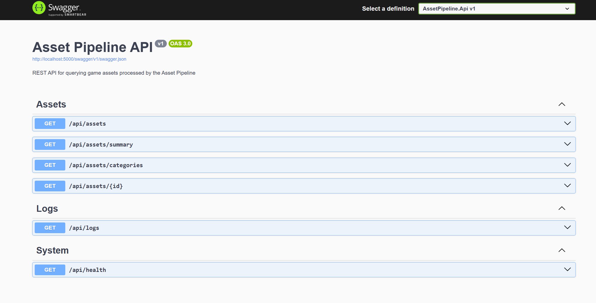
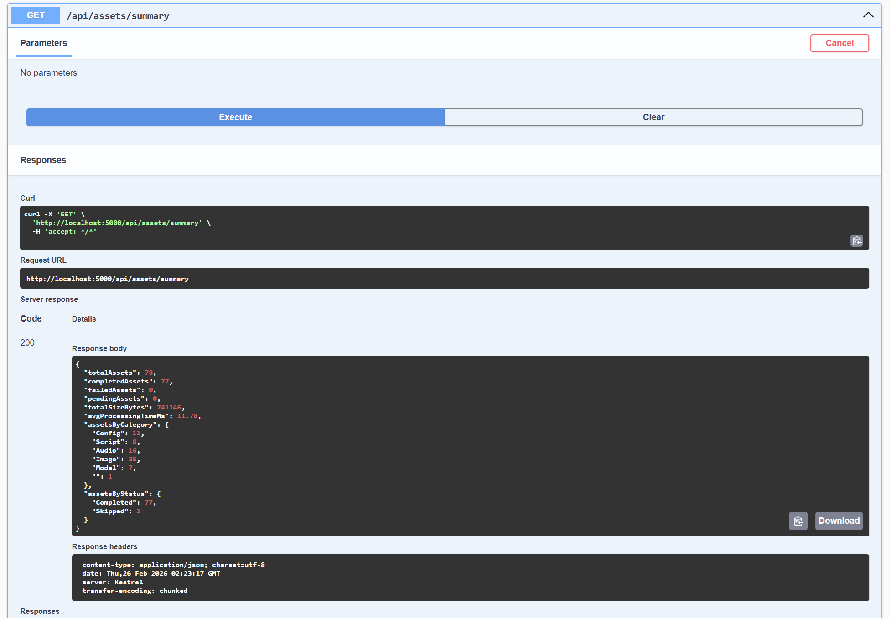

# ASSET PIPELINE PROCESSOR

An automated .NET asset processing pipeline with real time file watching, metadata extraction, SQLite storage and a REST API that is designed to simulate the kind of data processing pipelines that game studio tools teams build and maintain.

# PROJECT OVERVIEW

Game studios process thousands of assets daily and files like textures need validation, models need metadata extraction and the entire pipeline needs to be queryable and monitorable. This project implements a simplified version of that workflow:

1. **Processor** : A console application that scans directories, watches for file changes in real time and runs each asset through a multi-stage processing pipeline
2. **REST API** : An ASP.NET Core Web API that exposes the processed asset data for querying, filtering and monitoring
3. **Shared Core** : A class library with models, database context and processing logic shared between both applications

## ARCHITECTURE

```
-------------------------------------------------------
|                FILE SYSTEM                          |
| Game assets: images, audio, models, configs, etc.   |
-------------------------------------------------------   
                       | FileSystemWatcher
---------------------------------------------------------                       
|                      |                                |
|           ASSET PIPELINE PROCESSOR                    |  
|                                                       |
|  Stage 1: Discover   => Detects file, checks extension| 
|  Stage 2: Validate   => Verify if the file is readable| 
|  Stage 3: Hash       => MD5 for change detections     | 
|  Stage 4: Metadata   => Size, dates, image dims       | 
|  Stage 5: Store      => Write to SQLite database      |
---------------------------------------------------------   
                       | Entity Framework Core
-------------------------------------------------------
|                  SQLITE DATABASE                    |     
|  Processed Assets table + Pipeline logs table       |  
-------------------------------------------------------
                       | Entity Framework Core
-------------------------------------------------------
|              REST API (ASP.NET Core)                | 
|                                                     | 
|  GET /api/assets         -  Filtered asset list     | 
|  GET /api/assets/{id}    -  Single asset details    | 
|  GET /api/assets/summary - Pipeline statistics      |
|  GET /api/assets/categories - Category breakdown    | 
|  GET /api/logs            - Pipeline event logs     | 
|  GET /api/health          - Health check            | 
-------------------------------------------------------
```



## FEATURES

### Asset Pipeline Processor
- **Recursive directory scanning** with support for 30+ game asset file extensions
- **Real time file watching** using FileSystemWatcher that detects the creates, modifications, renames and deletes
- **Multi stage processing pipeline:** validation -> hash computation -> metadata extraction -> database storages
- **Change detection** via MD5 hashing - only reprocesses files that actually changed
- **Image dimension extraction** by parsing PNG and BMP binary headers directly eliminating the need of external image library dependency
- **Colored console output** with live progress and a summary dashboard
- **Interactive controls** - press *R* to rescan, *Q* to quit

### REST API
- **Numbered asset listing** with filtering by category, status and search term
- **Sorting** by name, size, date, category or status
- **Summary statistics** endpoint for dashboard integration
- **Category breakdown** with per category size and processing time averages
- **Pipeline logs** endpoint for monitoring processing events
- **Swagger/OpenAPI** documentation with interactive "Try it out" testing
- **CORS enabled** for frontend integration

### Shared Core Library
- **Entity Framework Core** with SQLite for zero configuration database
- **Code first schema** with proper indexing on frequently queried columns
- **Clean model separation** - ProcessedAsset, PipelineLog, PipelineSummary

## TOOLS AND TECHNOLOGIES

- **C#/ .NET 8.0** - application framework
- **ASP.NET Core Minimal APIs** - lightweight REST API pattern
- **Entity Framework Core** - ORM for database access
- **SQLite** - embedded database (needing zero configuration)
- **FileSystemWatcher** - real time file change detection
- **Swagger/OpenAPI** - API documentation and testing
- **MD5 Hashing** - file change detection
- **Multi project solution** - clean separation of concerns

## PROJECT STRUCTURE

```
asset-pipeline-processor/
|-- AssetPipeline.Core/              # Shared class library
|   |-- Models/
|   |   |-- ProcessedAsset.cs        # Data models - assets, logs, summary
|   |-- Data/
|   |   |-- PipelineDbContext.cs     # EF Core database context
|   |-- Services/
|       |-- AssetProcessingService.cs # Core processing pipeline logic
|-- AssetPipeline.Processor/         # Console app - file watcher
|   |-- Program.cs                   # Scanner + FileSystemWatcher
|-- AssetPipeline.Api/               # REST API
|   |-- Program.cs                   # Minimal API endpoints
|-- images/                          # Screenshots
|-- README.md
```

## GETTING STARTED

### Prerequisites
- Windows 10/11
- .NET 8.0 SDK
- Visual Studio 2022

### Build
```bash
# Clone the repository
git clone https://github.com/rush2pranav/asset-pipeline-processor.git

# Open AssetPipeline.sln in Visual Studio
# Build -> Build Solution (Ctrl+Shift+B)
```

### Run the Processor
1. Set **AssetPipeline.Processor** as the startup project
2. Press F5
3. Enter the path to a folder containing game assets
4. The processor will scan all files and begin watching for changes

### Run the API
1. Set **AssetPipeline.Api** as the startup project
2. Press F5
3. Open `http://localhost:5000/swagger` to explore the API
4. Use the interactive Swagger UI to test endpoints

### Run Both Together
For the full experience, run the Processor first (to populate the database), then run the API separately to query the results. In Visual Studio, you can right click the Solution -> Properties -> Startup Project -> Multiple startup projects.



## API REFERENCES

| Method | Endpoint | Description | Parameters |
|--------|----------|-------------|------------|
| GET | `/api/health` | Health check | - |
| GET | `/api/assets` | List assets | `category`, `status`, `search`, `sortBy`, `page`, `pageSize` |
| GET | `/api/assets/{id}` | Get asset by ID | `id` |
| GET | `/api/assets/summary` | Pipeline statistics | - |
| GET | `/api/assets/categories` | Category breakdown | - |
| GET | `/api/logs` | Recent pipeline logs | `limit` |

### Example Queries
```
GET /api/assets?category=Image&sortBy=size&page=1&pageSize=20
GET /api/assets?search=hero&status=Completed
GET /api/assets/summary
GET /api/logs?limit=100
```

## WHAT I LEARNED

- **Multi project solutions requires careful dependency management** - Sharing models and services through a Core library keeps both the Processor and API in sync without code duplication. This is the standard pattern for .NET microservice architectures.
- **FileSystemWatcher has quirks** - It can fire multiple events for a single file save, and files may still be locked when the event fires. Adding a small delay and proper error handling is essential for production reliability.
- **Entity Framework Core with SQLite is powerful for prototyping** - Zero configuration, no server to install, and the database file can be easily shared between processes. For a real studio pipeline, this would scale up to SQL Server or PostgreSQL.
- **Minimal APIs are a great fit for service oriented backends** - The lightweight ASP.NET Core Minimal API pattern avoids the ceremony of full controllers while still providing Swagger docs, dependency injection, and all the framework features.
- **File hashing for change detection is a core pipeline pattern** - Computing MD5 hashes is how real asset pipelines avoid redundant reprocessing - you only reprocess files whose content actually changed, not just their timestamps.

## POTENTIAL EXTENSIONS

- Add Docker containerization (Dockerfile + docker compose for both services)
- Implement webhook notifications when processing completes
- Add image thumbnail generation using ImageSharp
- Build a real time dashboard using SignalR for live pipeline monitoring
- Add support for asset dependency tracking (for understanding which assets reference which)
- Implement a retry queue for failed assets
- Add authentication and rate limiting to the API
- Scale to SQL Server with migrations for production deployment

## LICENCE

This project is licenced under the MIT Licence - see the [LICENCE](LICENSE) file for details.

---

*Built as part of a Game Tools Programmer portfolio. This project demonstrates .NET backend development, REST API design, database integration and pipeline architecture relevant to game studio tools teams. I am open to any and every feedback, please feel free to open an issue or connect with me on [LinkedIn](https://www.linkedin.com/in/phulpagarpranav/).*